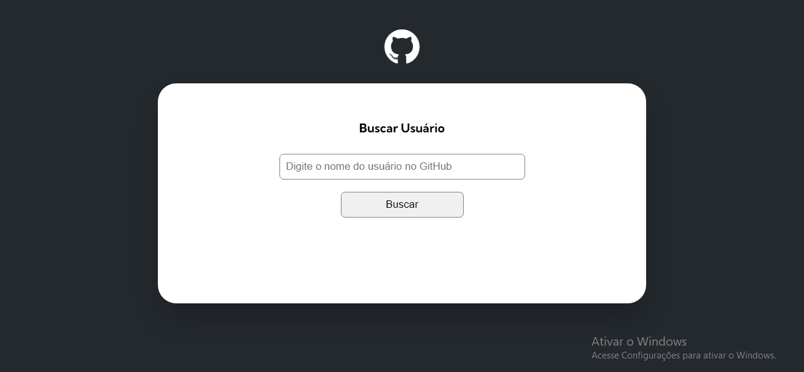

# Github API - User Search
### Sumary

- [The Project](#the-project)
- [Used Tecnologies](#used-tecnologies)
- [Design](#design)
    - [Desktop Design](#desktop-design)
    - [Mobile Design](#mobile-design)
- [What I Learn](#what-i-learn)
-[Author](#author)

## The Project

This project is a Github User Search using the Github API. They're a simple project that offers a input to search users from Github showing his basic profile infos (name, username, bio, followers and followings) and they repositories with the used language and some counts (forks, stargazers and watchers).

## Used Tecnologies

- Semantic HTML5 Markup
- CSS Flexbox and responsive with Media Queries
- Pure JavaScript
- Github API

## Design

The project design is simple, minimalist and responsive to the user screen device.

### Desktop Design 

### Mobile Design

## What I Learn
I have some dificulties using the Github API and Fetch, but this project helped me to improve my skills with API comands and JavaScript. I learn more about Json files and the how important a semantic code are to make the things easier.

## Author
Follow my profiles!

- Github: [/omatheusant](https://github.com/omatheusant)
- Linkedin: [/omatheussant](https://www.linkedin.com/in/omatheussant/)
- Twitter: [/omatheusant](https://twitter.com/omatheusant)